# 02 — Casos de Uso

## Actores

| Actor | Descripción |
|---|---|
| **Usuario** | Persona registrada. Ve y gestiona solo sus datos. Elige en Ajustes si registra gastos, ingresos o ambos. |
| **Administrador** | Usuario con `is_admin`. Accede a `/admin` y cruza datos de todos los usuarios (sin scoping). No puede eliminarse ni suspenderse a sí mismo. |
| **Consumidor API** | Cliente externo autenticado con un token Sanctum (`/api/v1`). |
| **Sistema (scheduler)** | Proceso programado que sincroniza la tasa Bs/USD. |
| **Instalador** | Quien despliega la instancia (wizard web, CLI o Docker). |

## Diagrama

```mermaid
flowchart TB
    subgraph Cuenta
        UC1[Registrarse / iniciar sesión]
        UC2[Verificar correo · 2FA · passkeys]
        UC3[Configurar tracking / comisiones / presupuesto / idioma / apariencia]
    end
    subgraph Movimientos
        UC4[Registrar gasto -incl. mixto y comisión Bs-]
        UC5[Registrar ingreso]
        UC6[Editar / eliminar / listar con filtros]
        UC7[Adjuntar comprobante]
    end
    subgraph Planificación
        UC8[Meta de ahorro + aportes]
        UC9[Pago recurrente + marcar pagado]
        UC10[Categorías y orígenes]
    end
    subgraph Reportes
        UC11[Dashboard]
        UC12[Reportes anuales / comparativo]
        UC13[Exportar CSV]
    end
    subgraph Tasas
        UC14[Ver tasa del día]
        UC15[Ajustar tasa manualmente]
        UC16[Sincronizar vía API -sistema-]
    end
    subgraph Administración
        UC17[Panel admin: usuarios / gastos / tasas]
        UC18[Auditoría de acciones]
        UC19[Backup JSON]
    end
    subgraph API
        UC20[Emitir token y consumir /api/v1]
    end
    Usuario --> UC1 & UC2 & UC3 & UC4 & UC5 & UC6 & UC7 & UC8 & UC9 & UC10 & UC11 & UC12 & UC13 & UC14 & UC15
    Administrador --> UC17 & UC18 & UC19
    ConsumidorAPI[Consumidor API] --> UC20
    Sistema --> UC16
```

## Detalle (los más relevantes)

### UC-04 Registrar gasto
- **Precondición:** sesión iniciada; al menos una categoría de gasto y un origen.
- **Flujo:**
  1. El usuario ingresa monto, moneda (USD/Bs/USDT), categoría, origen, fecha, nota.
  2. Si es **Bs**: se precarga la tasa del día (BCV/Paralelo/manual); el usuario puede
     ajustarla. Si elige pago móvil o transferencia, se precalcula la comisión
     `max(mínimo, monto × %)`, editable ("Sin comisión" disponible).
  3. Opcional: añade **ítems** en otras monedas (gasto mixto), cada uno con su tasa.
  4. Opcional: adjunta comprobante (imagen ≤ 5 MB).
  5. Guarda. El sistema (Action `StoreExpenseAction`) congela `usd_amount`/`usdt_amount`
     sobre `amount + commission` más el equivalente de cada ítem.
- **Reglas:** monto > 0; Bs ⇒ tasa > 0; `amount` guarda la base, la comisión va aparte.
- **Postcondición:** gasto visible en listado, dashboard y reportes; su tasa queda congelada.

### UC-05 Registrar ingreso
Análogo a UC-04 pero sin origen, comisión ni ítems. Requiere una categoría de tipo
`income`. Gated por `tracking_type ∈ {income, both}`.

### UC-08 Meta de ahorro
Crear meta con objetivo y moneda (se congela `target_usd_amount`). Registrar aportes
(opcionalmente ligados a un ingreso). `achieved_at` se marca/desmarca automáticamente al
comparar la suma de aportes con el objetivo.

### UC-09 Pago recurrente
Crear pago con `frequency` (diario…anual) y próximo vencimiento. "Marcar pagado" avanza
`next_due_date` según la frecuencia y setea `last_paid_at` — **no** crea un gasto.

### UC-13 Exportar CSV
Aplica los filtros del listado; genera un CSV en streaming (UTF-8 con BOM, celdas
protegidas contra inyección de fórmulas). Ver `05-reportes.md`.

### UC-16 Sincronizar tasa (sistema)
- El scheduler ejecuta `SyncExchangeRates` cada 5 min.
- `GET https://ve.dolarapi.com/v1/dolares` → lista `[{moneda, fuente, promedio}]`.
- Guarda `exchange_rates` (`user_id=null`, `source=api`, `provider=bcv|paralelo`, fecha hoy).
- Si falla: `report()` y conserva la última tasa. En dev, el Dashboard sincroniza al cargar.

### UC-17 Panel admin
Middleware `auth` + `verified` + `admin` (403 para el resto). Gestión de usuarios (editar,
verificar email, reset de contraseña, suspender/reactivar, eliminar con cascada), gastos
globales con export, tasas del día, categorías/orígenes globales.

### UC-20 API REST
`POST /api/v1/auth/register|login` devuelve un token Sanctum (90 días). Con el token
(`Authorization: Bearer …`) se accede al CRUD de gastos (incl. ítems mixtos), ingresos,
categorías, orígenes, reportes y tasas. Rate limit `api` 100/min. Doc OpenAPI en `/api/v1`.

## Matriz de prioridades (estado actual)

| Estado | Casos de uso |
|---|---|
| **Implementado** | UC-01 … UC-20 |
| **Parcial** | UC-09 (no genera el gasto automáticamente al vencer) |
| **Futuro** | Alertas de presupuesto; import de extractos; multi-tenant |
