# 02 — Casos de Uso

## Actores

| Actor | Descripción |
|---|---|
| **Usuario** | Persona registrada. Ve y gestiona solo sus propios datos (gastos, categorías, orígenes). |
| **Sistema (cron)** | Proceso programado que sincroniza la tasa Bs/USD desde la API. |

## Diagrama de casos de uso

```mermaid
flowchart TB
    subgraph Autenticación
        UC1[Registrarse]
        UC2[Iniciar sesión]
        UC3[Cerrar sesión]
    end

    subgraph Gastos
        UC4[Registrar gasto]
        UC5[Editar gasto]
        UC6[Eliminar gasto]
        UC7[Ver listado con filtros]
        UC8[Ver detalle del gasto]
    end

    subgraph Configuración
        UC9[Gestionar categorías]
        UC10[Gestionar orígenes]
    end

    subgraph Reportes
        UC11[Ver dashboard]
        UC12[Ver comparativo mensual]
        UC13[Exportar CSV]
    end

    subgraph Tasas
        UC14[Ver tasa del día]
        UC15[Ajustar tasa manualmente]
    end

    Usuario --> UC1
    Usuario --> UC2
    Usuario --> UC3
    Usuario --> UC4
    Usuario --> UC5
    Usuario --> UC6
    Usuario --> UC7
    Usuario --> UC8
    Usuario --> UC9
    Usuario --> UC10
    Usuario --> UC11
    Usuario --> UC12
    Usuario --> UC13
    Usuario --> UC14
    Usuario --> UC15

    Sistema --> UC16[Sincronizar tasa vía API]
```

## Detalle de casos de uso

### Autenticación

#### UC-01 Registrarse
- **Actor:** Usuario (invitado)
- **Precondiciones:** Ninguna.
- **Flujo principal:**
  1. El usuario accede a la página de registro.
  2. Ingresa nombre, correo y contraseña.
  3. El sistema crea la cuenta y categorías/orígenes por defecto.
  4. Se inicia sesión automáticamente y se redirige al dashboard.
- **Postcondiciones:** Cuenta creada, sesión iniciada, datos por defecto asignados.
- **Excepciones:** El correo ya existe → mensaje de error.

#### UC-02 Iniciar sesión
- **Actor:** Usuario
- **Flujo principal:** Correo + contraseña → sesión iniciada → dashboard.
- **Excepciones:** Credenciales inválidas, cuenta bloqueada por intentos (throttling).

#### UC-03 Cerrar sesión
- **Actor:** Usuario
- **Flujo principal:** Botón cerrar sesión → sesión destruida → página de login.

### Gastos

#### UC-04 Registrar gasto
- **Actor:** Usuario
- **Precondiciones:** Sesión iniciada. Debe existir al menos una categoría y un origen.
- **Flujo principal:**
  1. El usuario pulsa "Registrar gasto".
  2. Ingresa: monto, moneda (USD | Bs | USDT), categoría, origen, fecha, nota (opcional).
  3. Si la moneda es **Bs**, el sistema precarga la tasa del día (API); el usuario puede ajustarla manualmente.
  4. Opcional: adjunta imagen de comprobante.
  5. Guarda. El sistema calcula y almacena `usd_amount`.
- **Reglas de negocio:**
  - Monto > 0.
  - Moneda Bs ⇒ tasa requerida y > 0.
  - `usd_amount` = monto si USD o USDT; monto / tasa si Bs.
  - USDT se registra con su propio monto y también se expresa en USD (referencia 1:1) para reportes.
- **Postcondiciones:** Gasto visible en listado y reportes.

#### UC-05 Editar gasto
- **Actor:** Usuario
- **Flujo principal:** Abre detalle → modifica campos → guarda → recalcula `usd_amount`.
- **Excepciones:** No puede editar gastos de otro usuario (autorización por `user_id`).

#### UC-06 Eliminar gasto
- **Actor:** Usuario
- **Flujo principal:** Elimina → confirmación → se elimina el gasto y su comprobante (si existe).

#### UC-07 Ver listado con filtros
- **Actor:** Usuario
- **Flujo principal:** Pagina y filtra por: período (rango de fechas), moneda, categoría, origen, texto (nota/descripción), rango de monto.
- **Postcondiciones:** Totales del filtro mostrados (suma en USD y USDT).

#### UC-08 Ver detalle del gasto
- **Actor:** Usuario
- **Flujo principal:** Muestra todos los campos, tasa usada, equivalencia en USD y comprobante.

### Configuración

#### UC-09 Gestionar categorías
- **Actor:** Usuario
- **Flujo:** Crear, renombrar, cambiar ícono/color, eliminar. Eliminar una categoría con gastos → se bloquea o se pide reasignación.
- **Nota:** Se crean categorías por defecto al registrarse (Alimentación, Transporte, Servicios, Salud, Ocio, Ropa, Educación, Otros).

#### UC-10 Gestionar orígenes
- **Actor:** Usuario
- **Flujo:** Crear, renombrar, eliminar. Orígenes sugeridos por defecto: **Binance, Bancos, Wallets, Efectivo**.

### Reportes

#### UC-11 Ver dashboard
- **Actor:** Usuario
- **Flujo:** Muestra: total gastado del mes en **USD** y en **USDT**, desglose Bs/USD/USDT, gasto por categoría (gráfica), gasto por origen, últimos gastos, tendencia de los últimos 6 meses.

#### UC-12 Ver comparativo mensual
- **Actor:** Usuario
- **Flujo:** Tabla/gráfica mes a mes (últimos 12 meses) con total en USD y USDT, y variación % vs mes anterior.

#### UC-13 Exportar CSV
- **Actor:** Usuario
- **Flujo:** Aplica filtros → exporta CSV con columnas: fecha, descripción, categoría, origen, moneda, monto, tasa, equivalente USD, equivalente USDT.

### Tasas

#### UC-14 Ver tasa del día
- **Actor:** Usuario
- **Flujo:** El dashboard muestra la tasa Bs/USD vigente (BCV/paralelo según la API) con su fecha y fuente.

#### UC-15 Ajustar tasa manualmente
- **Actor:** Usuario
- **Flujo:** Sobrescribe la tasa del día con un valor manual; el sistema la marca como `manual` y la usa para nuevas transacciones Bs hasta que se actualice.

#### UC-16 Sincronizar tasa vía API (sistema)
- **Actor:** Sistema (cron/schedule)
- **Flujo principal:**
  1. El scheduler ejecuta la tarea cada 5 minutos (o bajo demanda).
  2. Consulta `https://ve.dolarapi.com/v1/dolares` (fuentes: BCV y paralelo).
  3. Guarda/actualiza la tasa del día en `exchange_rates` con fuente `api`.
  4. Si la API falla: registra el error y conserva la última tasa conocida (el usuario puede ingresarla manual).
- **Postcondiciones:** La tasa del día queda disponible para nuevos gastos en Bs.

## Matriz de prioridades (MoSCoW)

| Prioridad | Casos de uso |
|---|---|
| **Must have** | UC-01, UC-02, UC-03, UC-04, UC-05, UC-06, UC-07, UC-09, UC-10, UC-11, UC-14, UC-15, UC-16 |
| **Should have** | UC-08, UC-12, UC-13 |
| **Could have** | Restauración de contraseña, verificación de correo, modo oscuro, idioma EN |
| **Won't have (v1)** | Ingresos, presupuestos, saldos, multi-moneda por transacción |