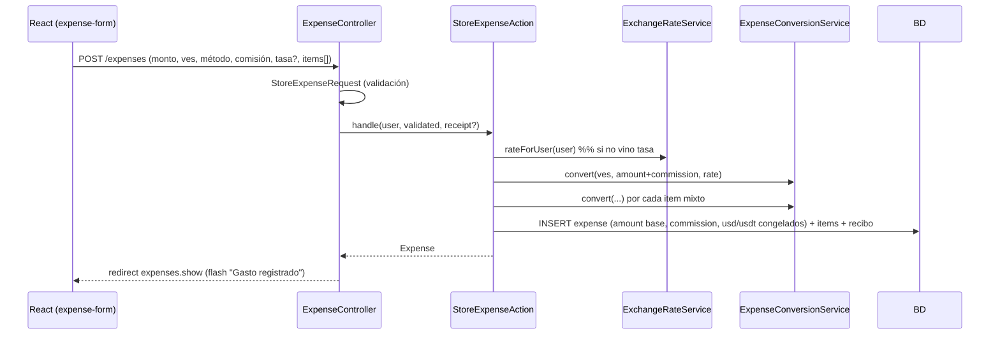
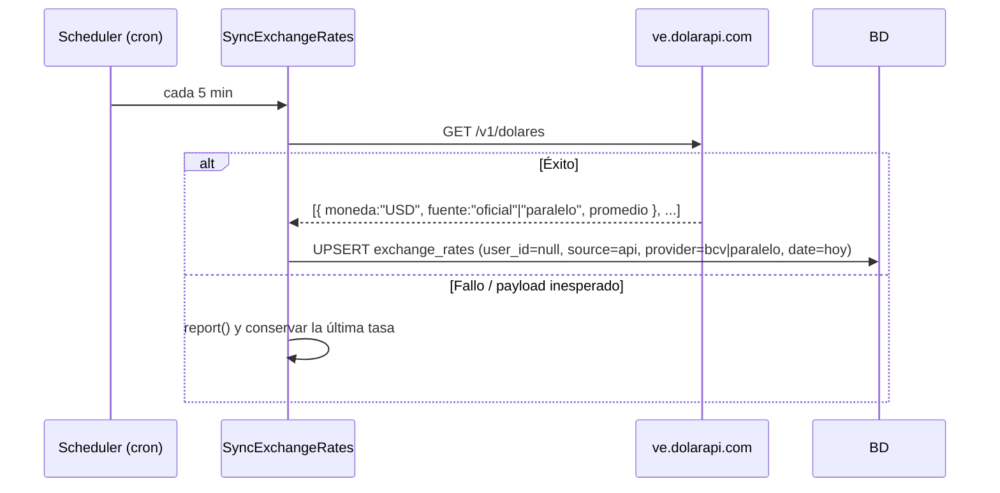

# 04 — Arquitectura

## Stack

| Capa | Tecnología | Notas |
|---|---|---|
| Backend | Laravel 13 (PHP 8.4.1+, 8.5 recomendado) | API + SSR vía Inertia |
| Auth | Laravel Fortify | Login, registro, verificación de correo, 2FA, passkeys |
| Frontend | Inertia v3 + React 19 + Tailwind 4 + shadcn/ui | SPA sobre Laravel |
| Rutas TS | Laravel Wayfinder | Helpers tipados `@/actions` / `@/routes` (importar del módulo agrupado) |
| Base de datos | SQLite / MySQL 8 / PostgreSQL 12+ | Driver por `.env` |
| Almacenamiento | Disco `storage/app/public` | Comprobantes; `php artisan storage:link` |
| Tasas | `https://ve.dolarapi.com/v1/dolares` | BCV + paralelo; fallback manual |
| API | Sanctum (tokens, 90 días) + Scramble (OpenAPI) | `/api/v1` |
| Charts | Componentes SVG propios (`resources/js/components/tracker/*`) | Sin librería |
| Tests | Pest + Larastan (nivel 7) + Pint | Obligatorios por cambio |
| Despliegue | cPanel / VPS / Docker | Ver `06`, `09` |

## Wiring: todo en `bootstrap/app.php`

Laravel 11+ — no hay `app/Http/Kernel.php` ni `app/Console/Kernel.php`. `bootstrap/app.php`
registra:

- **Rutas**: `web.php`, `api.php` (prefijo `api/v1`), `console.php`; `web.php` a su vez
  hace `require` de `settings.php` y `admin.php`.
- **Scheduler**: `SyncExchangeRates` job → `everyFiveMinutes()`.
- **Middleware y su orden** (ver abajo).
- **Excepciones**: respuestas JSON para `api/*` o `expectsJson()`.

### Orden de middleware

- Grupo `web` (append): `HandleAppearance` → `SetLocale` → `HandleInertiaRequests` →
  `AddLinkHeadersForPreloadedAssets` → `EnsureUserNotSuspended` (la suspensión se comprueba
  **antes** del middleware de ruta, incluido `admin`).
- Grupo `api` (prepend): `EnsureApiUserNotSuspended`.
- Aliases: `admin` → `EnsureUserIsAdmin`, `api.active` → `EnsureApiUserNotSuspended`.
- `EnsureTrackingFeature:<feature>` — middleware de ruta que oculta módulos (incomes,
  expenses, savings, recurring) según `users.tracking_type`.

## Capa de dominio

Los controllers son delgados: validación en **Form Requests**, orquestación en
**Actions de dominio** (`app/Actions/**`), matemática en **servicios**.

```
app/
├── Actions/
│   ├── Concerns/ResolvesTransactionRate.php   # tasa: submitted → tasa del día → error
│   ├── Expenses/{StoreExpenseAction,UpdateExpenseAction}.php
│   │   └── Concerns/PersistsExpense.php        # comisión Bs, items mixtos, congelado, recibos
│   └── Incomes/{StoreIncomeAction,UpdateIncomeAction}.php
│       └── Concerns/PersistsIncome.php
├── Services/
│   ├── ExpenseConversionService.php            # convert(currency, amount, rate) → {usd, usdt}
│   └── ExchangeRateService.php                 # rateForUser / ratesForUser / ensureFreshRate / syncFromApi
├── Support/
│   ├── CsvExporter.php                         # streaming CSV (BOM) + guard anti-inyección
│   └── Presenters/{ExpensePresenter,IncomePresenter}.php  # forma JSON única web + API
├── Jobs/SyncExchangeRates.php
├── Policies/                                   # scoping por recurso
└── Enums/{Currency,PaymentMethod,Frequency,CategoryType,TrackingType}.php
```

**Web y API comparten los Actions y los Presenters** — una sola implementación de la lógica
de negocio, sin duplicación entre `App\Http\Controllers\*` y `App\Http\Controllers\Api\V1\*`.

## Flujo: registrar un gasto en Bs con comisión



## Flujo: sincronización de tasas



> **Formato de payload**: dolarapi devuelve una **lista** de objetos con
> `moneda`/`fuente`/`promedio` (`fuente = "oficial"` ⇒ BCV). El formato antiguo
> `{"usd":{"bcv":…}}` se sigue aceptando por compatibilidad.
>
> **En dev el scheduler no corre**: `ensureFreshRate($user)` se llama en los page-loads de
> Dashboard/Ajustes/Expense create|edit. No quitarlo.

## Reglas de arquitectura

1. **Scoping por usuario**: toda consulta de datos de negocio filtra por `user_id`,
   reforzado por políticas de recurso.
2. **Conversión congelada**: `usd_amount`/`usdt_amount` se calculan al persistir; los
   reportes **jamás** recalculan con la tasa actual.
3. **Tasa por transacción**: `expenses.exchange_rate` congela la tasa; `exchange_rates`
   solo alimenta el precargado del formulario, que **nunca** hace HTTP en línea.
4. **Comisión Bs**: `commission = max(min_commission, amount × commission_rate%)` para pago
   móvil / transferencia. `expenses.amount` guarda la base; `commission` va aparte; el
   equivalente USD/USDT se calcula sobre `amount + commission`.
5. **Controllers delgados**: validación en Form Requests, lógica en Actions/servicios.
6. **i18n**: backend `lang/{es,en}` + `__()`; frontend `react-i18next` con
   `resources/js/i18n/{es,en}.json` vía shared props. `es.json` y `en.json` deben quedar
   key-idénticos (`I18nDictionaryTest`).
7. **Frontend**: páginas en `resources/js/pages`, `useForm`, navegación con Wayfinder
   (importar de `@/routes/<grupo>`, nunca de `@/routes`). Sin Blade para pantallas de app.
8. **API**: Eloquent nunca se serializa crudo hacia clientes; se pasa por un Presenter.

## Decisiones registradas (ADR)

### ADR-001 — Moneda de referencia doble (USD + USDT)
Se guardan ambos equivalentes porque el usuario quiere totales en las dos monedas. USDT se
trata 1:1 con USD (stablecoin referencial). Descartado: tratar USDT como moneda con tasa
flotante (complejidad sin beneficio).

### ADR-002 — Tasa automática con override manual, sin depender de la API en runtime
La API puede caer o cambiar; se persiste vía scheduler y el usuario siempre puede
sobrescribir. El formulario nunca bloquea por fallo de API.

### ADR-003 — Un gasto principal = una moneda, más ítems mixtos
La transacción tiene una moneda "principal"; las porciones en otras monedas van en
`expense_items`, cada una con su tasa y su equivalente congelado. Evita una tabla pivote
compleja y mantiene los reportes simples (todo suma en USD/USDT).

### ADR-004 — Rol admin como columna `is_admin`, sin paquete de roles
Solo hay dos niveles. `users.is_admin` (bool, fuera de `$fillable`) + middleware
`EnsureUserIsAdmin` protege `/admin`. Admin se crea con `php artisan admin:create` (paso
manual, una sola vez: el comando reescribe la contraseña desde `ADMIN_PASSWORD` en cada
ejecución, por eso no está en el entrypoint de Docker). El admin no puede eliminarse ni
suspenderse a sí mismo.

### ADR-005 — Multilenguaje ES/EN con i18next + shared props de Inertia
Sin petición extra por página. Resolución del locale: usuario → sesión → `APP_LOCALE` (es)
→ navegador. Detalle en `10-multilenguaje.md`.

### ADR-006 — Comisiones Bs con regla configurable "lo que sea mayor"
`max(min_commission, amount × commission_rate%)`, con piso y porcentaje por usuario
(defaults 14 Bs / 0,30%). El frontend precalcula al elegir método y deja el valor editable
("Sin comisión" disponible).

### ADR-007 — Actions de dominio compartidos entre web y API
`StoreExpenseAction`/`UpdateExpenseAction` (y sus equivalentes de Income) encapsulan
conversión + comisión + items + recibos. Los controllers web (Inertia) y API (JSON) los
llaman con el array validado; los `Presenter` unifican la salida. Elimina la duplicación
histórica entre `Controllers\*` y `Controllers\Api\V1\*`.

### ADR-008 — Sin instalador: configuración por `.env` (revierte el instalador dual-mode)
La app tuvo un instalador auto-hospedable (wizard `/install`, `app:install` y arranque
headless en Docker) gobernado por `APP_INSTALL_MODE`. **Se eliminó por completo.** El
despliegue es ahora el flujo estándar de Laravel: crear el `.env` a mano (o inyectar
variables de entorno), `php artisan key:generate`, `php artisan migrate --force` y
`php artisan admin:create`.

Consecuencia deliberada: **la app ya no arranca sin `APP_KEY`**. Antes el middleware
`EnsureInstalled` la rellenaba en caliente desde `storage/app.key` para que el wizard
funcionase sin configuración; ese middleware ya no existe. En Docker la clave la sigue
resolviendo `docker/entrypoint.d/98-spentz-key.sh` (la persiste en `storage/app.key`,
dentro del volumen, y la materializa en un `.env` mínimo).

### ADR-009 — API REST con tokens Sanctum
Tokens de acceso personal con expiración (90 días), `throttle:api` (100/min) y
`throttle:api.auth` (5/min por IP). CORS bloqueado a `CORS_ALLOWED_ORIGINS`. La UI de
documentación (Scramble) se expone en `/api/v1` y el spec en `/api/v1.json`, cerrada en
producción por el gate `viewApiDocs`.

### ADR-010 — Auditoría del panel admin (`admin_actions`)
Cada acción de administrador se registra con `AdminAction::record()`. El `target` es un
morph sin FK: el registro sobrevive al borrado del objetivo.

### ADR-011 — Datos por defecto en una Action, no en seeders de despliegue
Las categorías y orígenes de pago iniciales se asignan **al crear el usuario**, vía
`app/Actions/Users/AssignDefaultUserDataAction.php`, invocada por los dos caminos de
creación: `Fortify\CreateNewUser` (registro) y `CreateAdmin` (`admin:create`), que no pasa
por Fortify. La acción es idempotente (solo crea el set que falte), así que el upsert de
`admin:create` nunca duplica. `DefaultCategoriesSeeder` / `DefaultPaymentSourcesSeeder`
quedan solo como backfill para usuarios creados antes de esto; el despliegue no los
necesita.
