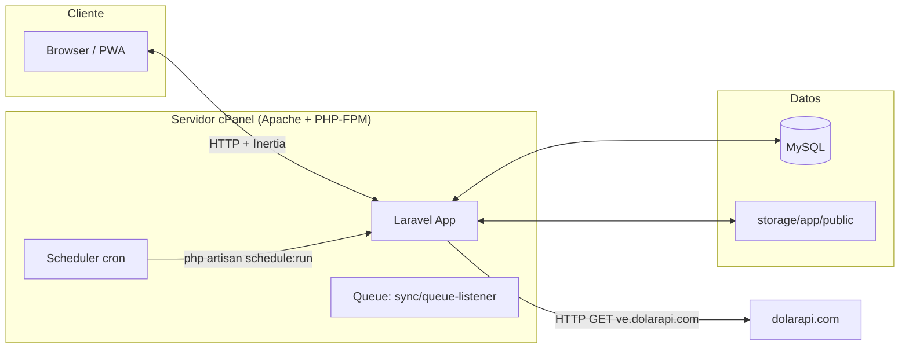
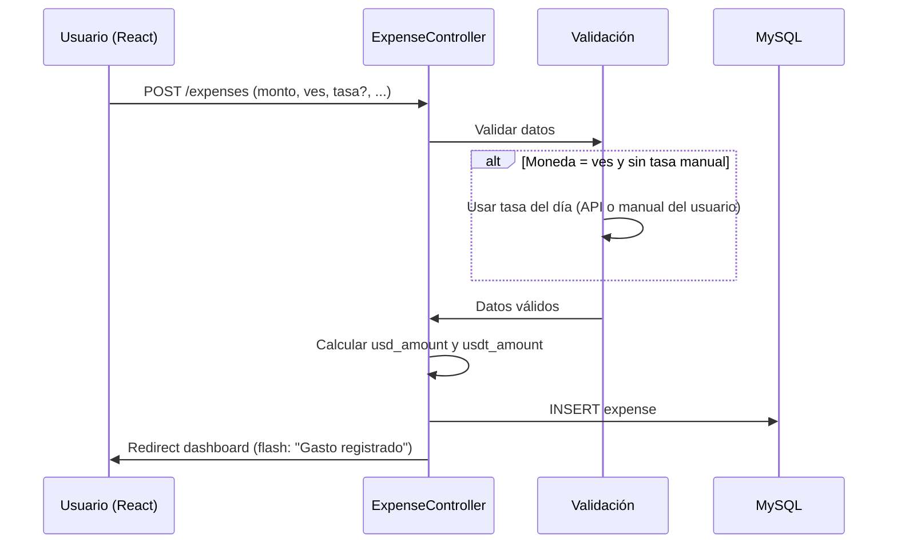
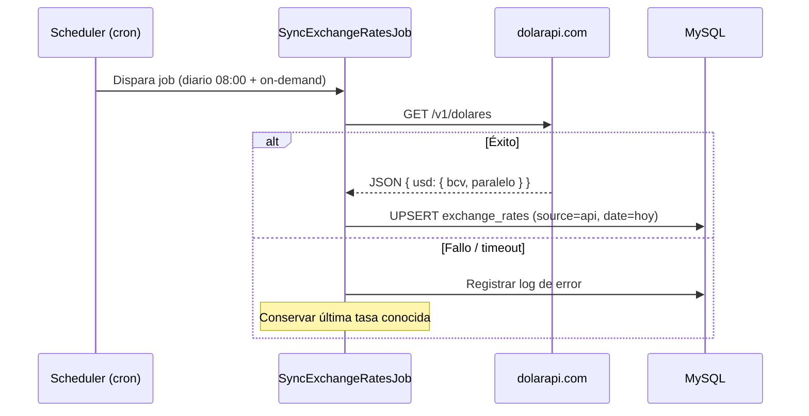

# 04 — Arquitectura

## Stack

| Capa | Tecnología | Notas |
|---|---|---|
| Backend | Laravel 13 (PHP 8.3+) | API + SSR vía Inertia |
| Auth | Laravel Fortify | Ya instalado; login, registro, sesiones |
| Frontend | Inertia v3 + React 19 + Tailwind 4 | SPA sobre Laravel |
| UI | shadcn/ui (Radix) | Componentes accesibles |
| Rutas TS | Laravel Wayfinder | Funciones tipadas `@/actions` / `@/routes` |
| Base de datos | MySQL (prod) / SQLite (dev) | Driver por `.env` |
| Almacenamiento | Disco local `storage/app/public` | Comprobantes; `php artisan storage:link` en cPanel |
| Tasas | API `https://ve.dolarapi.com/v1/dolares` | BCV + paralelo; fallback manual |
| Tests | Pest + Larastan + Pint | Obligatorios por cambio |
| Despliegue | cPanel (Apache) + MySQL | Ver `06-despliegue-cpanel.md` |
| PWA (fase 3) | Service Worker + manifest | Ver `07-roadmap.md` |

## Diagrama de arquitectura



## Flujo: registrar un gasto en Bs



## Flujo: sincronización de tasas (scheduler)



## Reglas de arquitectura

1. **Scoping por usuario:** toda consulta de datos de negocio filtra por `user_id` del autenticado. Políticas de autorización por recurso (`ExpensePolicy`, `CategoryPolicy`, `PaymentSourcePolicy`).
2. **Controllers delgados:** validación en `Form Requests`, lógica de conversión en un servicio `ExpenseConverter` (o accessor de modelo), no en el controller.
3. **Conversión única de moneda:** todo gasto guarda `usd_amount` y `usdt_amount` calculados al persistir; los reportes jamás recalculan con la tasa actual.
4. **Tasa por transacción:** `expenses.exchange_rate` congela la tasa usada; `exchange_rates` solo alimenta el precargado del formulario.
5. **Inertia:** páginas en `resources/js/pages`, formularios con `useForm`, navegación con Wayfinder. Sin Blade para pantallas de la app.
6. **API de tasas fuera del request del usuario:** se consulta solo vía scheduler/job; el formulario lee la última tasa persistida (nunca hace HTTP en línea).
7. **Comprobantes:** subida con validación de tipo/imagen y tamaño; guardado en disco público; nombre único generado por Laravel.
8. **Jobs/queues:** la sincronización de tasas va a la cola (`queue:listen` ya incluido en `composer run dev`); en cPanel se usa la cola por cron o driver `sync` si no hay supervisor.
9. **Caché:** tasa del día con `Cache::remember` (TTL corto, p. ej. 5 min) para no golpear MySQL en cada formulario.
10. **PWA futura:** los endpoints de Inertia deben ser compatibles con GET/offline básico; no introducir dependencias de tiempo real.

## Decisiones registradas (ADR)

### ADR-001: Moneda de referencia doble (USD + USDT)
Se guardan ambos equivalentes (`usd_amount`, `usdt_amount`) porque el usuario quiere totales en las dos monedas. USDT se trata como 1:1 con USD por ser stablecoin referencial. Alternativa descartada: tratar USDT como "otra moneda con tasa flotante" — añade complejidad sin beneficio.

### ADR-002: Tasa automática con override manual, sin depender de la API en runtime
La API de tasas (dolarapi.com) puede caer o cambiar; por eso se persiste diariamente vía scheduler y el usuario siempre puede sobrescribir. El formulario nunca bloquea por fallo de API.

### ADR-003: cPanel sin supervisor ⇒ cola vía cron
cPanel no garantiza supervisor/queue workers persistentes. Estrategia: jobs de tasa con driver `sync` o un cron que ejecute `queue:work --once` cada minuto (documentado en `06-despliegue-cpanel.md`).

### ADR-004: Un gasto = una moneda
v1 no soporta pagos mixtos (mitad Bs, mitad USD). Simplifica cálculo y reportes. Se puede agregar en v2 con tabla pivot.

## Estructura de código propuesta

```
app/
├── Http/Controllers/        # ExpenseController, CategoryController, PaymentSourceController, ReportController
├── Http/Requests/           # StoreExpenseRequest, UpdateExpenseRequest, ...
├── Models/                  # User, Expense, Category, PaymentSource, ExpenseReceipt, ExchangeRate
├── Services/                # ExchangeRateService (API + cache), ExpenseConversionService
├── Jobs/                    # SyncExchangeRatesJob
├── Policies/                # ExpensePolicy, CategoryPolicy, PaymentSourcePolicy
└── Console/Schedules/       # Registro de tarea de sincronización

database/
├── migrations/              # users(+extra), categories, payment_sources, expenses, expense_receipts, exchange_rates
└── seeders/                 # Categorías y orígenes por defecto

resources/js/pages/          # Dashboard, Expenses/Index, Expenses/Create, Expenses/Edit, Categories/Index, Sources/Index, Reports/Monthly
```